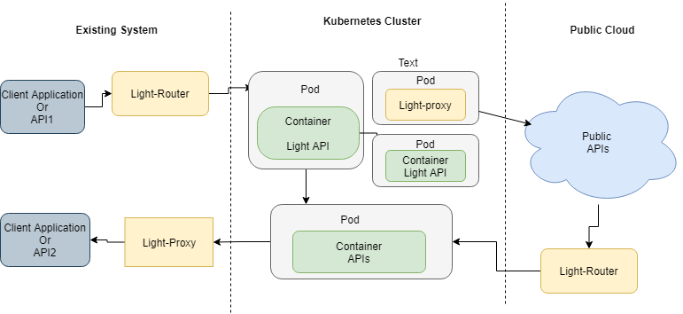

## light-gateway:

A standalone gateway combined light-proxy and light-router to address cross-cutting concerns for incoming and outgoing requests. Compared with the [http-sidecar](https://github.com/networknt/http-sidecar), which has the same light-proxy and light-router features, the light-gateway is more flexible for deployment. It can be deployed in a container, a Windows service or a Linux service. There might be multiple clients and services for light-gateway to support many-to-many communication. However, the http-sidecar is designed to deploy in the same Kubernetes pod with the backend API to form a one-to-one relationship. In other words, the http-sidecar is a stripped-down version of the light-gateway.

### Deployment Pattern

There are 6 patterns to deploy the light-gateway and the only difference is the configuration. The same jar file or docker image can be used for different use cases.

* External Gateway

The external gateway is deployed in the DMZ to help the third-party clients access APIs in the DMZ or corporate network. It is a shared gateway for multiple clients to access a limited number of APIs inside. Compared with the internal gateway, it has more security handlers configured. For example, an IP whitelist handler will allow certain IP addresses to access the gateway, or a rate-limiting handler is set up to prevent DDoS attacks, etc.

Verifying the JWT tokens is a very common practice on the external gateway to ensure only the valid requests will be passed through the firewall and sent to the internal gateway.

* Internal Gateway

The internal gateway is another shared gateway deployed inside the corporate network to help legacy clients to communicate with legacy services. The configuration should be very similar to the external gateway but remove some middleware handlers. For example, JWT token signature verification might not be enabled on the internal gateway.

* Client Router

In this pattern, only the router feature of the light-gateway is used to bring the legacy client to the light ecosystem. The instance is dedicated to a particular client application like a monolithic web server and deployed on the same host.

The gateway is responsible for getting the JWT token on behalf of the client, caching it, and renewing it before expiration. Also, the gateway will route all the API accesses so that the client will only deal with one API regardless of how many are behind the gateway.

* Service Proxy

In this pattern, only the reverse proxy feature of the light-gateway is used to bring the legacy service to the light ecosystem. The instance is dedicated to a particular service that exposes some API endpoints.

The gateway is responsible for verifying the JWT token, validating the incoming requests, and all other cross-cutting concerns. Then the request will be forwarded to one or many backend instances. With the light-gateway deployed on the same server, you don't need to update anything on the legacy server.


* Service Gateway

This pattern is similar to the service proxy but has the router feature enabled simultaneously. It is for legacy a service that accepts incoming requests and calls other APIs.


* Backend as Frontend

This is for a big application that will access a lot of backend microservices. The light-gateway will aggregate all the backend API together so that the client application can deal with only one API instead of hundreds. For example, a mobile banking application needs to access a lot of microservices for its functionalities.

* SPA Server

This is a similar pattern like the Backend as Frontend with added feature to serve the single page application on the same server without cors enabled.


    light-gateway can be deployed as API gateway to handle restful request/response related functionalities which include:

     - Package and deployed as separate module to handle Cross-Cutting Concerns for main container/service in the same pod. In this case, the main service only need care about the http request/response and business logic

     - Ingress traffic: client  request(legacy) will come to light-gateway first, light-gateway act as a proxy to delegate light client features, which include, openapi schema validation, observability, monitoring, logging, JWT verify, etc. Then forward the request to main service.

     - Egress traffic: main service call through light-gateway for egress traffic; in this case, light-gateway act as a router to delegate light client features, which include service discovery, SSL handshake, JWT token management, etc. Then forward the request to server API.


### Architecture diagram


- Se light-gateway deployment :



By default, the light-gateway works as internet gateway for both proxy/router features. Most of middleware handlers are commented out. User can enable it  based on different user cases.

Please refer to default setting for detail:

 [handler](https://github.com/networknt/light-gateway/blob/master/src/main/resources/config/handler.yml)
 [values](https://github.com/networknt/light-gateway/blob/master/src/main/resources/config/values.yml)

### Light-gateway features and config setting:

- Proxy

  Light-gateway Proxy used for dispatch the request from light-4j API to existing system (legacy). Since existing system may not have some microservice features, for example:

  - Audit log
  - JWT verify
  - Metrics
  - Openapi schema validation

  Light-gateway proxy can handle those features and forward the request to  existing system.

  The major config for proxy is "proxy.host", user can define a list of proxy destination host separate by ",'. For example

  proxy.host: https://localhost:9443,http://localhost:8080,https://www.networknt.com

- Router

  Light-gateway Router used for dispatch the request from existing system to light-4j restful API. Normally the existing system doesn't support some microservice feature for service call:

  - Service discovery
  - Audit log
  - JWT populate
  - Metrics

  Light-gateway Router can handle those features and forward the request to new microservice API.

  Light-gateway Router be triggered if the request header include key "service_id" or "service_url" (if both existing, service_url will be taken first)

  The major config for the router includes:

  serviceDict.mapping:
  router.hostWhitelist:


### Note:

If you want to use SidecarServiceDictHandler to get the service Id by the path url mapping from serviceDict.yml, add it before token handlers and router handler. The service Id get from serviceDict
will be used for next handler chain.

```
  - com.networknt.router.middleware.GatewayServiceDictHandler@path
  - com.networknt.router.middleware.GatewaySAMLTokenHandler@saml
  - com.networknt.router.RouterHandler@router

```


### start light-gateway locally and verify:

- start light-gateway service

```
cd ~/workspace
git clone git@github.com:networknt/light-gateway.git

cd light-gateway

mvn clean install


java -jar -Dlight-4j-config-dir=config/local  target/light-gateway.jar


```

The light-gateway service will start on http port 9080 and https port 9445.

The service API could use any technologies, like NodeJs, .nets, php service...; The light-gateway service will handle the ingress and egress traffic to the pod and leverage light-4j cross-cutting concerns and client module features.


- Start Nodejs restful API (It is simulate the service in the Pod)

Follow the [steps](nodeapp/start.md) to start Nodejs books store restful API. The Nodejs api will start on local port: 8080

We can verify the Nodejs restful API directly with curl command:

```
Get:

curl --location --request GET 'http://localhost:8080/api/books/' \
--header 'Content-Type: application/json' \
--data-raw '{"name":"mybook"}'

Post:

curl --location --request POST 'http://localhost:8080/api/books/' \
--header 'Content-Type: application/json' \
--data-raw '{"title":"Newbook"}'

Put:

curl --location --request POST 'http://localhost:8080/api/books/' \
--header 'Content-Type: application/json' \
--data-raw '{"title":"Newbook"}'

Delete:

curl --location --request DELETE 'http://localhost:8080/api/books/4' \
--header 'Content-Type: application/json' \
```


- Start a sample light-4j API from light-example-4j (It is simulate the outside service which service in the Pod need to call):


```
 cd ~/networknt
 git clone git@github.com:networknt/light-example-4j.git
 cd ~/networknt/light-example-4j/servicemesher/services

 mvn clean install -Prelease

cd petstore-service-api

java -jar target/petstore-service-api-3.0.1.jar

```

The petstore light-api will start on local https 8443 port.


- Try the call by using light-gateway:

#### Egress traffic (http protocol, port 9080)

Send request from service in the pod to light API petstore through light-gateway

```
curl --location --request GET 'http://localhost:9080/v1/pets' \
--header 'Content-Type: application/json' \
--data-raw '{"accountId":1,"transactioType":"DEPOSIT","amount":20}'
```

#### Ingress traffic (https protocol, port 9445)

Send request from outside service to the service in the pod through light-gateway

```
curl --location --request GET 'https://localhost:9445/api/books/' \
--header 'Content-Type: application/json' \
--data-raw '{"name":"mybook"}'
```

Leverage schema validation handler cross-cutting concerns

```
curl --location --request POST 'https://localhost:9445/api/books/' \
--header 'Content-Type: application/json' \
--data-raw '{"author":"Steve Jobs"}'
```

response:

```
{
    "statusCode": 400,
    "code": "ERR11004",
    "message": "VALIDATOR_SCHEMA",
    "description": "Schema Validation Error - requestBody.title: is missing but it is required",
    "severity": "ERROR"
}
```
#### Compile to native executable with Graalvm native-image

Graalvm and its native-image are required to compile uber jar file native executable, please following the [link](https://www.graalvm.org/java/quickstart) to install latest version of Graalvm

```
  mvn clean install

  native-image -jar target/light-gateway.jar -o target/application
```
you can execute the generated executable with following command:

```
  target/application -Dight-4j-config-dir=config/local
```
